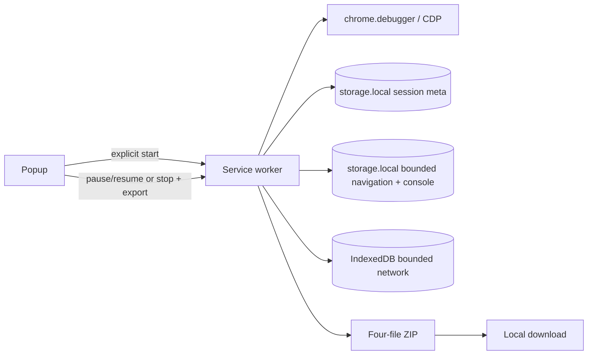

# Architecture

Browser Listener is a Manifest V3 Chrome extension for local-first browser session recording. Its output is a portable, redacted bug-reproduction/evidence bundle.

## Data flow



## Module boundaries

| Module | Responsibility |
|--------|----------------|
| `capture/` | Session lifecycle, debugger attach/recovery, safe body policy, stop/export |
| `background/` | MV3 service-worker entrypoint and captured-tab lifecycle |
| `persistence/` | Session metadata, preferences, bounded auxiliary evidence, IndexedDB network store, caps |
| `redaction/` | Default-deny headers, cookies, URL parameters, body values, and custom rules |
| `export/` | HAR, coverage, manifest, and four-file ZIP orchestration |
| `report/` | Searchable offline timeline and health report |
| `popup/` | Consent gate, session controls, health hints, download handoff |

## Capture strategy

1. Popup shows the effective capture profile and sends `CONSENT_AND_START` only after the user checks authorization.
2. Background validates current tab is ordinary HTTP(S), snapshots the immutable profile and policy, then attaches CDP.
3. CDP `Network.*` records network lifecycle. `Runtime.*` and `Log.entryAdded` record console evidence.
4. `tabs.onUpdated` records top-frame URL changes for the explicitly captured tab.
5. Pause/resume suspends debugger evidence and bounded auxiliary persistence; each interval is retained in session metadata. A profile cannot change after start.
6. CDP detach and MV3 restart paths retry while the session remains active.

There is no broad host monitoring or request interception fallback. CDP is authoritative while the user-visible debugger session is active.

## Storage and limits

- Session metadata uses `chrome.storage.local`.
- Navigation and console entries use per-session bounded local-storage arrays.
- Network entries use IndexedDB with a 128 MiB byte budget and 100,000-entry soft cap.
- Body capture is opt-in. Only JSON/text-like MIME types are eligible.
- Each body is capped at 256 KiB. Total body storage is capped at 4 MiB per session.
- Every eviction or auxiliary overflow increments `session.health.truncation`.

Redaction is enabled by default before persistence and again at export. Body text is parsed as JSON or form data when possible, then bounded. Headers and sensitive URL parameters are redacted while the preference is enabled. The preference is stored under `browserListenerRedactionEnabled` in `chrome.storage.local`; missing values normalize to enabled. A capture snapshots redaction state in session options, so storage and every export artifact use one consistent policy. Opt-out is explicit in the popup and displays a warning because raw HAR bodies and console records can contain secrets.

## Export contract

The ZIP contains exactly:

```text
report.html
raw.har
raw-console.json
export-manifest.json
```

`raw.har` is a HAR 1.2 log redacted by default. `raw-console.json` stores console, runtime exception, and browser log records redacted by default. `report.html` is a lightweight view and does not duplicate captured bodies. `export-manifest.json` records local-only privacy, redaction state, enabled capture options, coverage, pause intervals, truncation, persistence errors, and debugger gaps.

## Reliability

| Event | Behavior |
|-------|----------|
| MV3 service-worker restart | Detect active session and attempt CDP reattach |
| Debugger detach | Record gap, update health, retry while active |
| Tab close | Record gap, stop session, detach debugger, preserve export data |
| Storage pressure | Evict oldest network entries and surface counts in coverage |

## Permissions

| Permission | Rationale |
|------------|-----------|
| `storage` | Session metadata and bounded low-volume evidence |
| `unlimitedStorage` | Network IndexedDB budget |
| `downloads` | Local ZIP download |
| `activeTab` | Explicit current-tab authorization |
| `debugger` | CDP event capture and debugger recovery |

No host, request-interception, or broad navigation permission is required.

## Extension boundary

Capture remains local. There is no upload endpoint, account integration, site parser, classifier, political inference, or sensitive-trait analysis in the core extension. Future tooling can consume the generic bundle as a separate, opt-in project.
