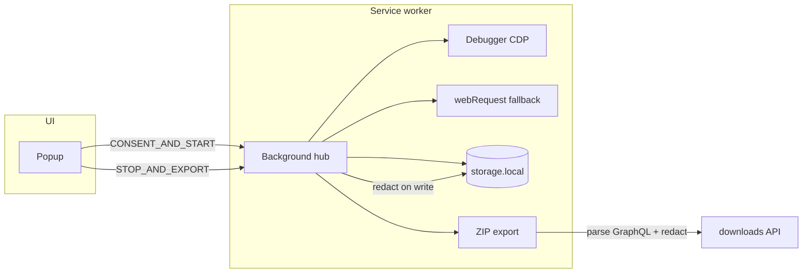
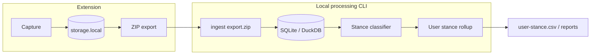

# Architecture

Browser Listener is a Manifest V3 Chrome extension for **collecting Facebook activity while browsing** — posts, comments, reactions, and people — and exporting a local ZIP for offline review.

## Data flow



## Module boundaries

| Module | Responsibility |
|--------|----------------|
| `capture/` | Session lifecycle, CDP debugger, GraphQL body capture, webRequest metadata |
| `redaction/` | Default-deny sensitive keys; applied on persist + export |
| `persistence/` | `chrome.storage.local`, caps, SW recovery |
| `export/` | ZIP orchestration, CSV, graphql-captures archive |
| `report/` | Facebook-focused offline HTML |
| `enrichers/` | Facebook GraphQL parser (always applied at export) |

## Capture strategy

1. **Debugger (CDP)** — `Network.*` on the captured tab for GraphQL request/response bodies. Shows Chrome’s debugging banner.
2. **webRequest** — metadata fallback when debugger is not attached. Skipped when CDP is active to avoid duplicate rows.

## Privacy / redaction

- Redaction runs on **write** (`persistence/store`) and again on **export** (`export/orchestrator`).
- ZIP export never uploads; `export-manifest.json` records `privacy.localOnly: true`.

## MV3 reliability

| Event | Behavior |
|-------|----------|
| Service worker restart | `chrome.storage.session` detects reboot; debugger reattach attempted |
| Debugger detach | Health gap logged; retry attach while session active |
| Tab closed mid-capture | Detach debugger, stop session, **keep** persisted data; popup offers partial export |
| Storage pressure | Network ring buffer with `health.truncation.network` count |

## Permissions

| Permission | Rationale |
|------------|-----------|
| `storage` | Session persistence |
| `downloads` | Local ZIP only |
| `tabs` | Target active tab |
| `debugger` | CDP GraphQL capture |
| `webRequest` | Network metadata fallback |
| `webNavigation` | Track tab URL during capture |
| `<all_urls>` | Capture on Facebook tabs (narrow before store publish) |

## Export bundle

Core files: `report.html`, `trace-summary.json`, `group-activity.json`, `graphql-captures.json`, `csv/*.csv`, `export-manifest.json`.

## Facebook data model

GraphQL bodies from `facebook.com/api/graphql` are parsed at export time by `src/enrichers/facebook-groups.ts`.

```
Post
├── surface (group | timeline | page)
├── groupId / groupName (when in a group)
├── text, author, media, share info
├── linkedReactions[]  → user, reactionType
└── linkedComments[]   → text, author
    └── linkedReactions[]  (capture-dependent — see roadmap)

FacebookReaction
├── target: post | comment
├── postId, commentId?, userId, reactionType?
└── source query (e.g. CometUFIReactionsDialog)
```

**Planned:** `causeTags[]` on posts, comments, and reactions for pro/anti/neutral labeling on chosen causes.

## Classification pipeline

Pro/anti user labeling (e.g. Trump) is a **downstream** concern. The extension captures and exports; a separate local ingest layer merges sessions and runs classifiers. Do **not** put a database inside the extension capture path — `chrome.storage.local` is session-scoped, size-limited, and unsuited to heavy analytics or re-processing.



### What the DB stores

| Store in DB | Keep in ZIP only |
|-------------|------------------|
| Parsed posts, comments, reactions, people | Raw `graphql-captures.json` (parser debug) |
| `content_labels` (cause, stance, confidence, classifier version) | Full network archive when not needed for re-parse |
| Ingest provenance (export checksum, session id, imported at) | — |
| Optional materialized `user_signals` / `user_stance` | — |

### Phasing

1. ~~**Extension export artifacts**~~ — `authorId` in CSVs, flat `user-activity` export, denormalized reaction context *(done)*.
2. **Blocking workstreams (1–4)** — stance labeling, processing pipeline, coverage report, capture completeness.
3. **Ingest CLI** — idempotent upsert from `group-activity.json` (+ flat exports) into SQLite.
4. **Labeling** — write `content_labels` for `cause: "trump"`; reactions inherit stance from labeled targets.
5. **Rollup** — aggregate per `userId` across all ingested sessions; export `user-stance.csv`.

### Blocking workstreams

| # | Workstream | Layer | Status |
|---|------------|-------|--------|
| **1** | Stance labeling — `causeTags` plumbing, Trump classifier, `content_labels` | Local CLI + export schema | Not started |
| **2** | Processing pipeline — ingest, multi-session merge, `user_stance` rollup | Local CLI / DB | Not started |
| **3** | Classification readiness report — `coverage-report.json` with field-level stats | Extension export | Not started |
| **4** | Capture completeness — reaction gaps, `partialParse`, truncation visibility | Extension capture | Partial (hydration exists; gaps remain) |

### Prerequisites before serious classification

| # | Feature | Layer | Status |
|---|---------|-------|--------|
| 1 | Classification readiness report (% text, authorId, reaction coverage) | Extension export | Not started |
| 2 | Stable `authorId` in JSON and CSVs | Extension export | Done |
| 3 | Flat `user-activity` export | Extension export | Done |
| 4 | Complete post reaction capture (hydration + dialog preference) | Extension capture | Partial |
| 5 | Comment reaction capture | Extension capture | Partial |
| 6 | Denormalized reaction context on export rows | Extension export | Done |
| 7 | `causeTags` enricher plumbing (generic schema) | Extension enricher | Not started |
| 8 | Content stance classifier (Trump first) | Local CLI | Not started |
| 9 | User stance rollup export | Local CLI | Not started |
| 10 | Multi-session merge via ingest | Local CLI / DB | Not started |

### Capture completeness (#4)

Reaction-based classification needs both **who reacted** and **what they reacted to** (`targetText`). Current gaps:

| Gap | Cause | Planned fix |
|-----|-------|-------------|
| Tooltip-only post reactors | User hovered Like count; full dialog not opened | Export hydration uses `CometUFIReactionsDialogTabContentRefetchQuery` with `ALL_REACTION_TYPE_IDS` + pagination |
| Missing comment reactors | Comment `feedbackId` not in capture; comment not hydration target | `selectNextCommentForHydration` + export pass budgets for comments |
| `reactionType` missing | Tooltip rows lack per-user type | `backfillReactionTypes` peers dialog rows onto tooltip rows |
| `targetText` missing on reactions | Post/comment not captured or `partialParse` | Prioritize hydration for reactions lacking `targetText`; improve partial JSON text extraction |
| Truncated network buffer | >10k GraphQL rows dropped | Surface in `coverage-report.json`; optionally raise cap or spill to IndexedDB |

Hydration already runs in two phases: slow session sampling (`SAMPLE_REACTION_TYPE_IDS`) and a final `runExportReactionHydration` pass before ZIP. Remaining work is **coverage-driven target selection** (hydrate under-covered content first), **budget tuning** tied to coverage metrics, and **paginating until `captured >= reactionCount`** per target.

## Extensibility

Register enrichers in `src/enrichers/index.ts`. All registered enrichers run at export time. Classification enrichers that need cross-session state belong in the local ingest CLI, not the extension.
