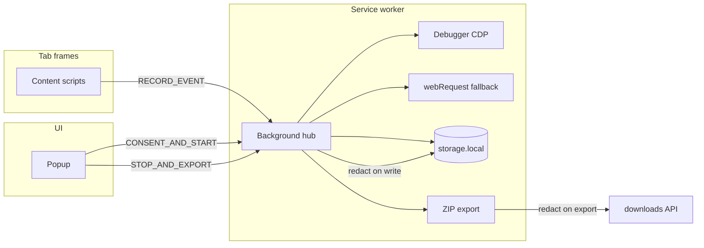

# Architecture

Browser Listener is a Manifest V3 Chrome extension that records a consent-gated browser session and exports a local ZIP for offline investigation.

## Data flow

## Module boundaries

| Module | Responsibility |
|--------|----------------|
| `capture/` | Session lifecycle, CDP debugger, webRequest metadata |
| `content/` | Console (when CDP off), user actions, navigation, diagnostics |
| `redaction/` | Default-deny sensitive keys; applied on persist + export |
| `persistence/` | `chrome.storage.local`, caps, SW recovery |
| `export/` | HAR, cURL, ZIP orchestration |
| `report/` | Standalone offline HTML |
| `enrichers/` | Optional post-processors (opt-in per session) |

## Capture strategy

1. **Debugger (CDP)** — primary for console (`Runtime.*`) and network (`Network.*`) on the captured tab. Shows Chrome’s debugging banner.
2. **webRequest** — metadata fallback when debugger is not attached. Skipped when CDP is active to avoid duplicate network rows.
3. **Content scripts** (`all_frames: true`) — user actions, navigation, DOM snapshots, diagnostics. Console wrapping only when CDP is off.

State is broadcast to every frame via `webNavigation.getAllFrames` + `tabs.sendMessage({ frameId })`, with a 2s poll fallback in each frame.

## Privacy / redaction

- No capture before explicit consent checkbox.
- Redaction runs on **write** (`persistence/store`) and again on **export** (`export/orchestrator`).
- Header names use substring match; object field names use exact match (so `sessionId` is not wiped).
- ZIP export never uploads; `export-manifest.json` records `privacy.localOnly: true`.

## MV3 reliability

| Event | Behavior |
|-------|----------|
| Service worker restart | `chrome.storage.session` detects reboot; `health.serviceWorkerRestarts++`; debugger reattach attempted |
| Debugger detach | Health gap logged; retry attach while session active; content falls back to webRequest + content console |
| Tab closed mid-capture | Detach debugger, stop session, **keep** persisted data; popup offers partial export |
| Storage pressure | Ring buffers for diagnostics/DOM; caps on console/network/timeline/userActions with `health.truncation` counts |

## Permissions

| Permission | Rationale |
|------------|-----------|
| `storage` | Session persistence |
| `downloads` | Local ZIP only |
| `tabs` | Target active tab |
| `debugger` | CDP capture |
| `webRequest` | Network metadata fallback |
| `webNavigation` | All-frame capture state broadcast |
| `pageCapture` | Optional MHTML snapshot on stop (tab must exist) |
| `<all_urls>` | Capture on user pages (narrow before store publish) |

## Export bundle

Core files: `report.html`, `trace-summary.json`, `network.har`, `timeline.json`, `console.json`, `diagnostics.json`, `export-manifest.json`. Optional: `artifacts/page.mhtml` when tab is available at stop time.

## Extensibility

Register enrichers in `src/enrichers/index.ts`. Enable via `CaptureOptions.enricherIds`. Core export must work with an empty registry.
