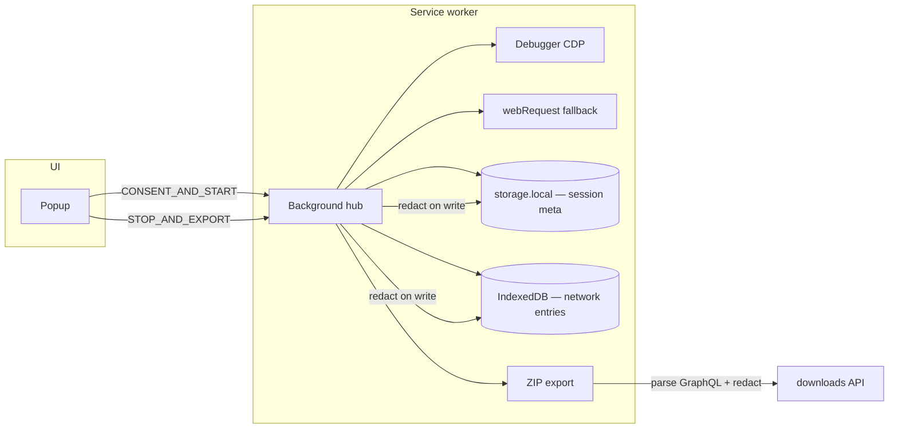

# Architecture

Browser Listener is a Manifest V3 Chrome extension for **creating portable, searchable Facebook session archives** — posts, comments, reactions, people, provenance, and capture health — with no upload or telemetry.

## Data flow



## Module boundaries

| Module | Responsibility |
|--------|----------------|
| `capture/` | Session lifecycle, CDP debugger, GraphQL body capture, webRequest metadata |
| `redaction/` | Default-deny sensitive keys; applied on persist + export |
| `persistence/` | `chrome.storage.local` (session meta), IndexedDB (network entries), caps, SW recovery |
| `export/` | ZIP orchestration, CSV, coverage, graphql-captures archive |
| `report/` | Searchable, citation-friendly offline archive HTML |
| `enrichers/` | Facebook GraphQL parser (always applied at export) |

## Capture strategy

1. **Debugger (CDP)** — `Network.*` on the captured tab for GraphQL request/response bodies. Shows Chrome’s debugging banner.
2. **webRequest** — metadata fallback when debugger is not attached. Skipped when CDP is active to avoid duplicate rows.

## Privacy / redaction

- Redaction runs on **write** (`persistence/store`) and again on **export** (`export/orchestrator`).
- ZIP export never uploads; `export-manifest.json` records `privacy.localOnly: true`.
- Capture is restricted to HTTPS Facebook hosts and requires an explicit start action.
- Users should capture only pages and data they are authorized to collect.

## MV3 reliability

| Event | Behavior |
|-------|----------|
| Service worker restart | `chrome.storage.session` detects reboot; debugger reattach attempted |
| Debugger detach | Health gap logged; retry attach while session active |
| Tab closed mid-capture | Detach debugger, stop session, **keep** persisted data; popup offers partial export |
| Storage pressure | IndexedDB byte budget + entry soft cap; oldest entries evicted; `health.truncation.network` count |

## Permissions

| Permission | Rationale |
|------------|-----------|
| `storage` | Session metadata persistence |
| `unlimitedStorage` | Large GraphQL body retention in IndexedDB |
| `downloads` | Local ZIP only |
| `tabs` | Target active tab |
| `debugger` | CDP GraphQL capture |
| `webRequest` | Network metadata fallback |
| `webNavigation` | Track tab URL during capture |
| `https://facebook.com/*`, `https://*.facebook.com/*` | Capture authorized Facebook tabs only |

## Export bundle

Core files: `report.html`, `trace-summary.json`, `coverage-report.json`, `group-activity.json`, `graphql-captures.json`, `csv/*.csv`, `export-manifest.json`.

## Facebook data model

GraphQL bodies from `facebook.com/api/graphql` are parsed at export time by `src/enrichers/facebook-groups.ts`.

```
Post
├── surface (group | timeline | page)
├── groupId / groupName (when in a group)
├── text, author, media, share info
├── linkedReactions[]  → user, reactionType
└── linkedComments[]   → text, author
    └── linkedReactions[]  (capture-dependent — see roadmap)

FacebookReaction
├── target: post | comment
├── postId, commentId?, userId, reactionType?
└── source query (e.g. CometUFIReactionsDialog)
```

## Coverage and provenance

`coverage-report.json` is generated at export time from the redacted session data. It records the
source URL and capture interval, entity totals, field-level presence metrics, parser warnings, and
storage/lifecycle quality signals. The offline report renders the same information and provides a
copyable citation containing the source, capture interval, and session id.

Exports are observational archives, not guaranteed complete copies of a page. Current completeness gaps include:

| Gap | Cause | Planned fix |
|-----|-------|-------------|
| Tooltip-only post reactors | User hovered Like count; full dialog not opened | Export hydration uses `CometUFIReactionsDialogTabContentRefetchQuery` with `ALL_REACTION_TYPE_IDS` + pagination |
| Missing comment reactors | Comment `feedbackId` not in capture; comment not hydration target | `selectNextCommentForHydration` + export pass budgets for comments |
| `reactionType` missing | Tooltip rows lack per-user type | `backfillReactionTypes` peers dialog rows onto tooltip rows |
| `targetText` missing on reactions | Post/comment not captured or `partialParse` | Prioritize hydration for reactions lacking `targetText`; improve partial JSON text extraction |
| Truncated network buffer | Byte budget or entry soft cap exceeded | Evict oldest entries; surface in `coverage-report.json` |

Hydration already runs in two phases: slow session sampling (`SAMPLE_REACTION_TYPE_IDS`) and a final `runExportReactionHydration` pass before ZIP. Remaining work is coverage-driven target selection (hydrate under-covered content first), budget tuning tied to coverage metrics, and paginating until `captured >= reactionCount` per target.

The extension remains ZIP-export only. `npm run inspect -- export.zip` reads the archive locally and
prints its manifest, provenance, entity totals, quality warnings, and file list. Sensitive-trait or
political inference is explicitly outside the core extension; any future analysis must be a separate,
opt-in local tool with its own privacy review.

## Extensibility

Register enrichers in `src/enrichers/index.ts`. All registered enrichers run at export time. New site
adapters should be added only after their permissions, capture scope, redaction behavior, and export
privacy boundary are documented.
