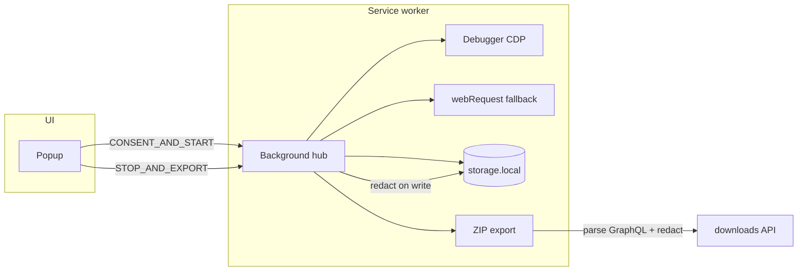

# Architecture

Browser Listener is a Manifest V3 Chrome extension for **collecting Facebook activity while browsing** — posts, comments, reactions, and people — and exporting a local ZIP for offline review.

## Data flow



## Module boundaries

| Module | Responsibility |
|--------|----------------|
| `capture/` | Session lifecycle, CDP debugger, GraphQL body capture, webRequest metadata |
| `redaction/` | Default-deny sensitive keys; applied on persist + export |
| `persistence/` | `chrome.storage.local`, caps, SW recovery |
| `export/` | ZIP orchestration, CSV, graphql-captures archive |
| `report/` | Facebook-focused offline HTML |
| `enrichers/` | Facebook GraphQL parser (always applied at export) |

## Capture strategy

1. **Debugger (CDP)** — `Network.*` on the captured tab for GraphQL request/response bodies. Shows Chrome’s debugging banner.
2. **webRequest** — metadata fallback when debugger is not attached. Skipped when CDP is active to avoid duplicate rows.

## Privacy / redaction

- Redaction runs on **write** (`persistence/store`) and again on **export** (`export/orchestrator`).
- ZIP export never uploads; `export-manifest.json` records `privacy.localOnly: true`.

## MV3 reliability

| Event | Behavior |
|-------|----------|
| Service worker restart | `chrome.storage.session` detects reboot; debugger reattach attempted |
| Debugger detach | Health gap logged; retry attach while session active |
| Tab closed mid-capture | Detach debugger, stop session, **keep** persisted data; popup offers partial export |
| Storage pressure | Network ring buffer with `health.truncation.network` count |

## Permissions

| Permission | Rationale |
|------------|-----------|
| `storage` | Session persistence |
| `downloads` | Local ZIP only |
| `tabs` | Target active tab |
| `debugger` | CDP GraphQL capture |
| `webRequest` | Network metadata fallback |
| `webNavigation` | Track tab URL during capture |
| `<all_urls>` | Capture on Facebook tabs (narrow before store publish) |

## Export bundle

Core files: `report.html`, `trace-summary.json`, `group-activity.json`, `graphql-captures.json`, `csv/*.csv`, `export-manifest.json`.

## Facebook data model

GraphQL bodies from `facebook.com/api/graphql` are parsed at export time by `src/enrichers/facebook-groups.ts`.

```
Post
├── surface (group | timeline | page)
├── groupId / groupName (when in a group)
├── text, author, media, share info
├── linkedReactions[]  → user, reactionType
└── linkedComments[]   → text, author
    └── linkedReactions[]  (planned — comment reactors)

FacebookReaction
├── target: post | comment (comment not populated yet)
├── postId, commentId?, userId, reactionType?
└── source query (e.g. CometUFIReactionsDialog)
```

**Planned:** `causeTags[]` on posts, comments, and reactions for pro/anti/neutral labeling on chosen causes.

## Extensibility

Register enrichers in `src/enrichers/index.ts`. All registered enrichers run at export time.
